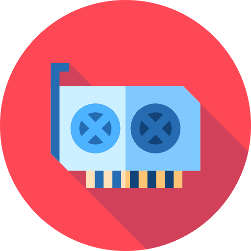

[](https://www.codefactor.io/repository/github/architector1324/easycl)
[](https://en.cryptobadges.io/donate/1SrJvWx4MD1D7SPV236swT5jYJhug86tX)

# Easy Computing Library


Icon made by [Freepik](https://www.flaticon.com/authors/freepik) from www.flaticon.com

## Overview
***EasyCL*** is an open heterogeneous computing library (*GPL v 3*) based on the [***OpenCL***](https://www.khronos.org/opencl/) specification. It's header-only library.

It is designed for easy and convenient use, at the same time optimized. It is not built on the OpenCL object wrapper from [**Khronos**](https://www.khronos.org/), but uses the original [***The OpenCL 1.2 C Specification***](https://www.khronos.org/registry/OpenCL/specs/opencl-1.2.pdf).

The library allows you to bypass some of the inconveniences of the original *OpenCL*, providing work with **abstractions** of different levels, allows you to bypass the **restriction of hard binding** of arguments to the kernel, kernels to the program, programs to the final device.

* At the moment, only OpenCL 1.2 is supported

## Installation
 1) Install OpenCL library on your system
 1) Clone the repo `$ git clone https://github.com/architector1324/EasyCL`
 2) Copy `EasyCL.hpp` to your project

## Hello, World (Single Thread)
 1) Copy `EasyCL.hpp` to project folder
 2) Create `main.cpp`:

```c++
#include <iostream>
#include "EasyCL.hpp"

int main(){
    ecl::Program prog = ecl::Program::loadProgram("kernel.cl");
    ecl::Kernel kern = "test";
    ecl::Variable<int> a = 0;

    a += 3;

    auto p = ecl::System::getPlatform(0);
    ecl::Computer video(0, p, ecl::DEVICE::GPU);

    video.send({&a});

    ecl::Thread th(prog, kern, {&a}, &video);
    th.join();

    std::cout << a << std::endl;

    ecl::System::free();
    return 0;
}
```

 3) Create `kernel.cl`:
```c
__kernel void test(__global int* a){
    *a += 2;
}
```

 4) Type in terminal:
```bash
$ g++ -lOpenCL -o a.out main.cpp
$ ./a.out
```

Output:
```
5
```

## Hello, World (SIMD)
 1) Copy `EasyCL.hpp` to project folder
 2) Create `main.cpp`:

```c++
#include <iostream>
#include "EasyCL.hpp"

int main(){
    ecl::Program prog = ecl::Program::loadProgram("kernel.cl");
    ecl::Kernel kern = "test";
    ecl::Array<int> a(12);

    auto p = ecl::System::getPlatform(0);
    ecl::Computer video(0, p, ecl::DEVICE::GPU);

    video.send({&a});
    video.compute(prog, kern, {&a}, {12}, {3});
    video.grab({&a});

    for(size_t i = 0; i < 12; i++)
        std::cout << a[i] << " ";
    std::cout << std::endl;

    ecl::System::free();
    return 0;
}
```
 3) Create `kernel.cl`:
```c
__kernel void test(__global int* a){
    size_t i = get_global_id(0);
    a[i] = (int)get_group_id(0) + 1;
}
```

 4) Type in terminal:
```bash
$ g++ -lOpenCL -o a.out main.cpp
$ ./a.out
```

Output:
```
1 1 1 2 2 2 3 3 3 4 4 4
```

## Hello, World (Struct)
 1) Copy `EasyCL.hpp` to project folder
 2) Create `main.cpp`:

```c++
#include <iostream>
#include "EasyCL.hpp"

struct Vertex{
    float x, y, z;
};

int main(){
    ecl::Program prog = ecl::Program::loadProgram("kernel.cl");
    ecl::Kernel kern = "test";
    ecl::Variable<Vertex> v({0, 0, 0});

    auto p = ecl::System::getPlatform(0);
    ecl::Computer video(0, p, ecl::DEVICE::GPU);

    video.send({&v});

    ecl::Thread th(prog, kern, {&v}, &video);
    th.join();

    std::cout << v.getValue().x << std::endl;
    std::cout << v.getValue().y << std::endl;
    std::cout << v.getValue().z << std::endl;

    ecl::System::free();
    return 0;
}
```

 3) Create `kernel.cl`:
```c
typedef struct{
    float x, y, z;
} Vertex;

__kernel void test(__global Vertex* v){
    v->x = 1;
    v->y = 2;
    v->z = 3;
}
```

 4) Type in terminal:
```bash
$ g++ -lOpenCL -o a.out main.cpp
$ ./a.out
```

Output:
```
1
2
3
```

## API
### Abstractions
#### Arguments
It is an abstraction of the arguments of the kernel of a program. Once created, the argument can be used in different kernels and in different OpenCL programs. There are two different types of arguments:
##### Variables
```c++
ecl::Variable<T>();
ecl::Variable<T>(const& T value);
ecl::Variable<T>(ecl::ACCESS);
ecl::Variable<T>(const T& value, ecl::ACCESS);
```

Example:
```c++
ecl::Variable<int> a; // not-initialized
ecl::Variable<int> b = 5; // b = 5
ecl::Variable<float> c(7.0f, ecl::ACCESS::READ); // c = 7.0f (read-only)
```
*Note*:
```c++
ecl::ACCESS::READ; // read-only data
ecl::ACCESS::WRITE; // write-only data
ecl::ACCESS::READ_WRITE; // default
```

To get /set value:
```c++
const T& getValue() const;
void setValue(const T& value);
```

Also you can use overloaded operators:
```c++
var++;
var--;
var = const T&;
var += const T&;
var -= const T&;
var *= const T&;
var /= const T&;

Variable<T>& = var + const T&;
Variable<T>& = var - const T&;
Variable<T>& = var * const T&;
Variable<T>& = var / const T&;

operator T&(); // casting-overload
```

Example:
```c++
ecl::Variable<int> a = 3;
ecl::Variable<int> b = 5;

a += 2; // a = 5
a -= b; // a = 0

b.setValue(3); // b = 3
b = 3; // same

b = b * a; // b = 0
```

Example:
```c++
void foo(int a){
    std::cout << a << std::endl; // 5
}

ecl::Variable<int> a = 5;
foo(a);
```

*Note*: So, if any function takes a reference or const reference, or value of `T` you may pass `Variable<T>` instead!


You can use (copy / move) (constructors / operator=):
```c++
// copy
Variable<T>(const Variable<T>&);
var = const Variable<T>&;

// move
Variable<T>(Variable<T>&&);
var = std::move(Variable<T>&&);
```

Example:
```c++
ecl::Variable<int> a;
ecl::Variable<int> b = 5;
ecl::Variable<int> c = b; // copy

a = b; // copy
```

```c++
ecl::Variable<int> a = 2;
ecl::Variable<int> b = std::move(a);
// now 'a' is empty, 'b' grabs all data
ecl::Variable<int> c = 4;

c = std::move(b);
/*
now 'b' is empty
'c' erase itself data and grabs it from 'b'
*/
```

You can use variables with ostreams:
```c++
ostream& << const Variable<T>&;
```

Example:
```c++
ecl::Variable<double> a = 6.0;
std::cout << a; // 6.0
```

*Note*: All these operation done only on host. To know how to work with devices, look at `Computer` section.

##### Arrays
```c++
ecl::Array<T>();
ecl::Array<T>(size_t array_size);
ecl::Array<T>(size_t array_size, ecl::ACCESS);
ecl::Array<T>(const T* array, size_t array_size, ecl::CONTROL);
ecl::Array<T>(T* array, size_t array_size, ecl::ACCESS, ecl::CONTROL);
```

Example:
```c++
ecl::Array<int> a; // not-initialized

// new int[5], it will automatically free
ecl::Array<int> b(5);

int C[4] = {1, 2, 3, 4};
ecl::Array<int> c(C, 4, ecl::CONTROL::FREE);
/*
you have to clear 'C' manually
in this case, it's on stack
so, no problems
*/

// read-only array, it will automatically free
ecl::Array<int> d(new int[6], 6, ecl::ACCESS::READ, ecl::CONTROL::BIND);

// another example
int* E = new int[3];
ecl::Array<int> e(E, 3, ecl::CONTROL::FREE); // you have to clear 'E' manually

delete[] E;
```

*Note*:
```c++
ecl::ACCESS::READ; // read-only for array
ecl::ACCESS::WRITE; // write-only for array
ecl::ACCESS::READ_WRITE; // default
```

```c++
ecl::CONTROL::BIND; // after deleting an object, it frees memory from array pointer
ecl::CONTROL::FREE; // doesn't free array, you have to free it manually
```

To get pointer to array:
```c++
const T* getConstArray() const;
T* getArray();
```

To change pointer to array:
```c++
void setArray(const T* array, size_t array_size);
void setArray(T* array, size_t array_size, ecl::ACCESS);
```

Also you can use overloaded access operator:
```c++
T& array[size_t]
```

Example:
```c++
ecl::Array<float> a(3);

a[0] = 0.0f;
a[1] = 1.0f;
a[2] = -3.4f;
```

You can use (copy / move) (constructors / operator=):
```c++
// copy
Array<T>(const Array<T>&);
arr = const Array<T>&;

// move
Array<T>(Array<T>&&);
arr = std::move(Array<T>&&);
```

Example:
```c++
ecl::Array<int> a;

int B[] = {1, 2, 3, 4, 5};
ecl::Array<int> b(B, 5);

ecl::Array<int> c = b; // copy hole B array

a = b; // copy hole B array
```

```c++
int A[] = {1, 2, 3};
ecl::Array<int> a(A, 3);

ecl::Array<int> b = std::move(a);
// now 'a' is empty, 'b' grabs a pointer to 'A'

ecl::Array<int> c(4);

c = std::move(b);
/*
now 'b' is empty
'c' erase itself data and grabs it from 'b'
*/
```

Also as in **Variables**, you can use overloaded casting:
```c++
operator T*();
```

Example:
```c++
void foo(const int* a){
    std::cout << a[0] << std::endl; // 1
    std::cout << a[1] << std::endl; // 2
    std::cout << a[2] << std::endl; // 3
}

int A[] = {1, 2, 3};
ecl::Array<int> a(A, 3);

foo(a);
```


You can use arrays with ostreams as a pointer:
```c++
ecl::ostream& << const ecl::Array<T>&;
```

Example:
```c++
int A[] = {1, 2, 3};
ecl::Array<double> a(A, 3);

std::cout << A;
std::cout << a; // same address as 'A'
```

*Note*: All these operation done only on host. To know how to work with devices, look at `Computer` section.


#### Kernels
This is an abstraction of kernels in the OpenCL program. Once created, the kernel can be used in various programs.
```c++
Kernel(const char* name);
Kernel(const std::string& name);
```

Example:
```c++
ecl::Kernel myKern = "name_of_my_kernel";
```

To get / set kernel name:
```c++
const std::string& getName() const;
void setName(const std::string& name);
```

You can use overloaded operators:
```c++
myKern = const char*;
myKern = const std::string&;

myKern += const char*;
myKern += const std::string&;
myKern += const std::Kernel&;

Kernel kern = myKern + const char*;
Kernel kern = myKern + const std::string&;
Kernel kern = myKern + const std::Kernel&;
```

Example:
```c++
ecl::Kernel kern = "name";
ecl::Kernel temp = "_of_my_";

kern += temp + "kernel"; // name_of_my_kernel
```

Also you can use (copy / move) (constructors / operator=):
```c++
// copy
Kernel(const Kernel&);
kern = const Kernel&;

// move
Kernel(Kernel&&);
kern = std::move(Kernel&&);
```

Example:
```c++
ecl::Kernel kern = "test";
ecl::Kernel kern2 = kern; // copy Kernel from kern
ecl::Kernel temp = "";

temp = std::move(kern); // now kern is clear, temp grab Kernel
```

#### Programs
This is an abstraction of the program from the devices of the final execution. Once created, the program can be used on various devices.
```c++
ecl::Program(const char* src);
ecl::Program(const std::string& src);
```

Example:
```c++
ecl::Program myProg = "__kernel void name_of_my_kernel(){...}";
```
Also you can load source program from file:
```c++
static std::string loadProgram(const std::string& filename);
```
To get / set source:
```c++
const std::string& getSource() const;
void setSource(const std::string& src);
```

Operators, copy / move constructors, ostream interaction is the same as in `Kernel`

#### Computers
This is an abstraction of the execution device, which is a logical execution device. One physical execution device may have several computers.
```c++
ecl::Computer video(size_t device_index, const ecl::Platform* platform, ecl::DEVICE);
```

*Note*:
```c++
ecl::DEVICE::CPU; // CPU
ecl::DEVICE::GPU; // GPU
ecl::DEVICE::ACCEL; // Accelerator
```

Example:
```c++
auto plat = ecl::System::getPlatform(0); // first platform
ecl::Computer video(0, plat, ecl::DEVICE::GPU); // first GPU on this platform
```

Sending data to Device:
```c++
void send(const std::vector<ArgumentBase*>& args);
```
Receiving data from Device:
```c++
void receive(const std::vector<ArgumentBase*>& args);
```
Releasing data in Device:
```c++
void release(const std::vector<ArgumentBase*>& args);
```
Grabbing data from Device:
```c++
void grab(const std::vector<ArgumentBase*>& args);
```
*Note*: it's just receives data from device and release it. 

Execute program on Device (SIMD):
```c++
void compute(ecl::Program& prog, ecl::Kernel& kern, const std::vector<ArgumentBase*>& args, const std::vector<size_t>& global_work_size);
void compute(ecl::Program& prog, ecl::Kernel& kern, const std::vector<ArgumentBase*>& args, const std::vector<size_t>& global_work_size, const std::vector<size_t>& local_work_size);
```

#### Threads
A thread is an abstraction of a thread on an executable device. After creating a thread, it will be immediately executed on the device, and the data will also be read when synchronizing the thread with the host or when it is destroyed.

Execute program on Device (Single thread):
```c++
ecl::Thread th(ecl::Program& prog, ecl::Kernel& kern, const std::vector<ArgumentBase*>& args, ecl::Computer* video);
```
Sync single threads:
```c++
void join();
```